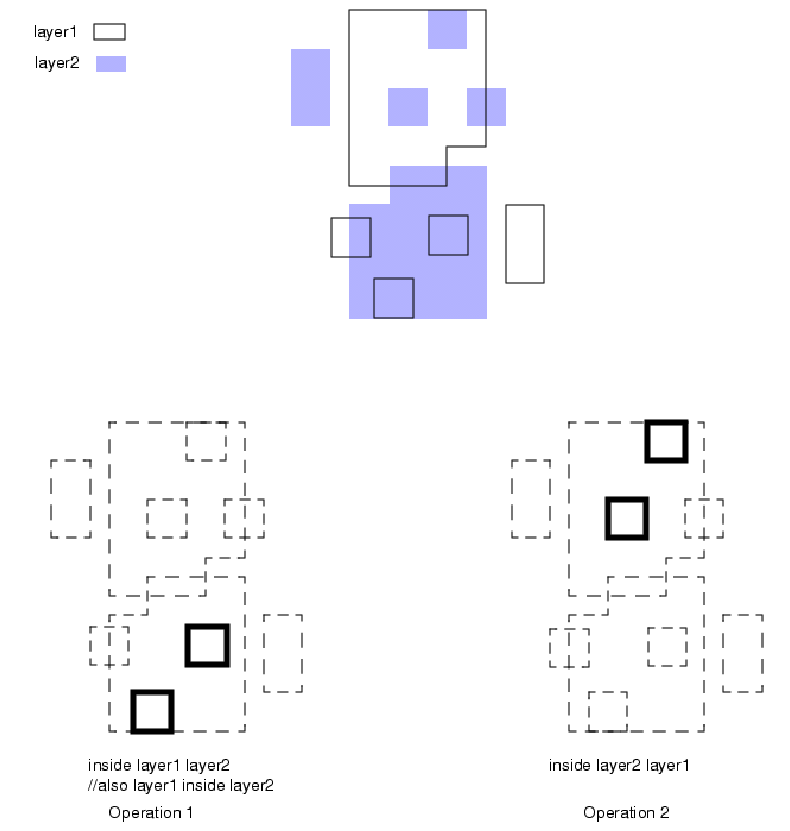

# LVS Manual
The LVS verification is done in Calibre using a SVRF(Standard Verification Rule Format) or TVF(Tcl Verification Format) scripting language in the background. This write-up will throw light on the whole process in a simplified and more understandable manner.
## LVS Data Flow

*Source: Calibre Verification User Manual*
## Input Files
1. Rule file: A SVRF or TVF code which contains all the information of the layers and the devices.
2. Layout Database: The extracted netlist from layout and its related information is contained here.
3. Source Database: Contains the netlist of schematic(source) in SPICE and its related informations.
## Rule file
* This is further classified into 2 types: 
  1. Specification statements: Used to define layout and source databases, paths to output files and set the working environment for the process. 
  2. Layer operations: Provides the layer data by performing operations on them thus deriving the layer informations.
* A simple diagram to depict the structure of the rule files in Calibre is given below:

  1. `_xt018_1243_` : A template has been provided [rulefile1](https://github.com/prachi-mrudula/verification/blob/main/LVS/_xt018_1243_temp)
  2. `xt018_1243` : A template has been provided [rulefile2](https://github.com/prachi-mrudula/verification/blob/main/LVS/xt018_1243_temp)
  3. `xt018.rul` : This is the main rule file containing all the layer and device definitions, layer operations, rule checks, connectivity information and setup defaults. Information on the commands used are provided in the next section.
### Commands used in rule file:
* LAYER: Defines the name of an original layer or a layer set that Calibre uses. 
   * Format:- `LAYER name original_layer` where,
      * `name`: A required name for an original layer or layer set. 
      * `original_layer`: The layer number of an original layer. 
   * Example:- `LAYER diff_dg 50030` Defines the diffusion layer. 
   
* LAYER MAP: Enables Calibre to map layer numbers, DATATYPE attributes, and TEXTTYPE attributes in GDS and OASIS databases to layer numbers that Calibre uses in the rule file. 
   * Format: `LAYER MAP source_layer DATATYPE/TEXTTYPE source_type target_layer`, where
      * `source_layer` : The layer number in layout database for mapping.
      * `DATATYPE`: This maps drawn geometric layers.
      * `TEXTTYPE`: This maps text layer objects.
      * `source_type`: It specifies a particular datatype or texttype in the layout database.
      * `target_layer`: It specifies the layer number to be used by Calibre. 
   * Example:- `LAYER MAP 7 DATATYPE 0 50070 LAYER pimp 50070` :- Maps p-implant layer.
   
* TEXT LAYER : Specifies the layers in the layout database from which text is read for connectivity extraction. The connectivity extractor uses only those text objects having layers that appear in Text Layer specification statements. Thus, if there are no Text Layer specification statements in the rule file, then no layout database text objects are used by the connectivity extractor, and there will be no net names assigned from such objects. 
   * Format:- `TEXT LAYER layer`, where
       * layer: A required layer name or number in the database from which to read connectivity extraction text. 
   * Example:- `TEXT LAYER MET1_TEXT` :- specifies Metal1 to be used as a text layer.

* PORT LAYER TEXT : Causes Port Layer Text objects on the specified layer(s) to be read and treated as top-level ports in geometric databases. Its object names in the top-level cell are output by the SPICE netlister(calibre -spice) as top-level subcircuit pin names. Port text objects can be attached to port shapes using explicit attachment (Attach), implicit attachment (both port text and port shapes are on the same Connect layer), or free attachment(Label Order).
   * Format:- `PORT LAYER TEXT layer`, where
       * layer: A required layer name or number that can be treated as port. 
   * Example:- `PORT LAYER TEXT MET1_TEXT` :- specifies Metal1 text layer to be treated as a port.

* ATTACH : attaches connectivity information from a layer1 object to a layer2 object. It is used for naming nets and ports. It transfers connectivity information from a specified original database source layer (a text layer) to a specified original or derived target layer that appears in a Connect or Sconnect operation. Most often, Attach is used when there is a single text layer (or a few text layers) that is used for label assignment throughout the design. Format:- `ATTACH A B`, where `A` is a Text Layer argument (or A is a layer set that contains the label layer), then the connectivity extractor looks for a polygon on layer `B` that intersects the label location. If found, the label name is assigned to the net that contains that polygon.
    * Format:- `ATTACH layer1 layer2`, where
       * layer1: A required original layer.
       * layer2: A required original layer or layer set, or a derived polygon layer. Must appear as an input layer to a Connect or Sconnect operation.
    * Example:- `ATTACH MET1_TEXT m1trm ` :- attaches connectivity from metal1 text layer to a derived layer m1trm.
    
* LVS BOX : Specifies cells whose contents are to be excluded from circuit comparison or circuit extraction,or both. 
   * Format: `LVS BOX [BLACK | GRAY [DEVICES]] [LAYOUT [ONLY]] [SOURCE]` where, 
      * `BLACK` is : An optional keyword that specifies only pin geometries of box cells are processed while other geometries in the cell are ignored by default. The specified box cells are processed independently of placement context, and the internal geometries of the box cells are unavailable for downstream processing. Netlisting of black box cell contents does not occur. The LVS Black Box Port specification statement is required when using this keyword.
      
* LVS BLACK BOX PORT : Defines port objects for the LVS Box BLACK statement. Specifies that original_layer polygons belonging to an LVS Box BLACK cell, and intersecting with text_layer objects at the same hierarchical level, form cell ports. 
  * Format: `LVS BLACK BOX PORT original_layer text_layer interconnect_layer`, where
    * `original_layer` : A required original layer or layer set that forms a port for a black box cell. By default, these polygons are at the primary level of the box cell.
    * `text_layer` : A required name of an original layer or layer set containing text objects that name ports for a black box cell. The text objects that name ports must intersect original_layer objects and be at the same hierarchical level as the original_layer objects in order to form box cell ports. By default, the text objects are at the primary level of the box cell. This layer must be a Text Layer argument in order for black box cell ports to be in the netlist.
    * `interconnect_layer` : A required original layer or layer set, or a derived polygon layer, containing objects that connect to the original_layer outside of the black box cell. Connectivity must be established on this layer from a Connect or Sconnect statement.
   * Example:- `LVS BLACK BOX PORT met1_dg MET1_TEXT m1trm` 
  
* RECTANGLES : Generates an output layer consisting of an array of rectangles with the specified dimensions and spacing. 
   * Format: `RECTANGLES width length {spacing | {width_spacing length_spacing}} {INSIDE OF LAYER layer}`, where
      * `width length` : A required pair of positive, floating-point numbers that indicate the width (x-axis) and length (y-axis) of a rectangle, in user units.
      * `spacing` : A required, positive, floating-point number that indicates the spacing in user units, in both the x- and y- directions, between rectangles. When you use this option, the width_spacing length_spacing option cannot be used.
      * `width_spacing length_spacing` : A pair of required, positive, floating-point numbers that indicate the width spacing (x-axis) and length spacing (y-axis), respectively, between rectangles. When you use this option, the spacing option cannot be used.
      * `INSIDE OF LAYER layer` : An optional keyword set that specifies a layer having polygons to be filled with rectangles. The layer indicates the name of an original or derived polygon layer.
  * Example: `thinmet_fill_all = RECTANGLES 5 2 2 INSIDE OF LAYER (EXTENT)`
  
* CONNECT : Defines electrical connections on input layers. Specifies electrical connections among layer1 and layerC objects, and the first available layer2 through layerN object, in that order. The layers specified as layer1 and layerC are connected when they have mutual area overlap with one of layer2 through layerN. The first object found from among layer2 through layerN at a given location participates in the connection; no other layers from that set become connected.
   * Format: `CONNECT <layer1> <layer2>......<layer N> BY <layer C>`
     * `<layer1> <layer2>......<layer N>` are required original layers/layer sets or a derived polygon layers.
     * `<layer C>` specifies a contact, cut or via layer.
   * Example: `CONNECT p1trm m1trm BY CONT` - p1trm is the topmost layer connected to m1trm through contact layer.
   
* SCONNECT : Specifies one-directional connection between objects on specified layers. Passes connectivity from the upper_layer polygons to lower_layer polygons. Connections are unidirectional; nodal information is passed from upper_layer to lower_layer, but not in the other direction. Connectivity information is passed from upper_layer objects to lower_layer objects, through contact_layer objects. The lower_layer objects must have overlapping area common to both upper_layer and contact_layer objects. That is, polygons from all three of these layers must have a mutual intersection in order for connectivity to be passed.
    * Format: `SCONNECT upper_layer lower_layer [lower_layer ...] {BY contact_layer}`
      * `upper_layer` A required original layer or layer set, or a derived polygon layer. The layer must carry nodal information.
      * `lower_layer`  can specify a maximum of 32 of these layers in a single statement. Any layer specified as a lower_layer cannot simultaneously be a contact_layer in any Sconnect operation. Any lower_layer may be specified as a lower_layer in a different Sconnect operation. 
      * `BY contact_layer` The keyword BY must always precede the name of this contact layer. There can be only one BY keyword per Sconnect operation.
   * Example: `SCONNECT pdiff bulk BY ptap`
   
A bunch of commands are used to perform the layer operations. Some of them are mentioned below:
* AND : Constructs the intersection regions of polygons on the input layer(s) and outputs the intersections as polygons.
  * Format : Single layer syntax: `AND layer1 [constraint]`
             Two-layer syntax: `AND layer2 layer3` 
  * Example : Some examples are:
       
       
     
* OR : Merges all intersecting polygons on the input layers into single polygons.
  * Format : Single layer syntax: `OR layer1 [constraint]`
             Two-layer syntax: `OR layer2 layer3`
  * Example: More insight can be obtained from the following diagram:
        
     
* NOT : Two-layer Boolean operation that selects polygon areas not common to polygons from a second layer.
  * Format : `NOT layer1 layer2`
  * Example: An image has been provided as an example:
        
     
* CUT : Selects polygons that share some, but not all of their area with polygons from a second layer. 
  * Format : `CUT layer1 layer2 [constraint [BY NET] [EVEN | ODD]]` where
     * `layer1, layer2` The layers derived or original.
     * `constraint` This constraint specifies the number of layer2 polygons or nets that a layer1 polygon must share some (but not all) of its area with to be selected by the Cut operation. The constraint must contain non-negative integers.
     * `BY NET` specifies that a layer1 polygon is selected when a number of distinct nets in the set of layer2 polygons, which share some of their area with the layer1 polygon, meets the specified constraint. 
     * `EVEN | ODD` A layer1 polygon is selected if the number of layer2 polygons that meet the constraint is also an even number/odd number respectively. 
  * Example : Following are some examples to explain more about the command.
       
       
     
* AREA : Selects polygons that meet an area constraint.
  * Format : `AREA layer constraint`
  * Example:
  
        
     
* EXTENT : Generates a derived polygon layer consisting of one rectangle that equals the database extent read in at runtime, including text. If you specify the optional layer parameter, the rectangle represents the minimum bounding box of all objects on layer. In hierarchical mode, Calibre may choose to divide the extent rectangle into polygons that are distributed across the hierarchy to facilitate more efficient processing of subsequent operations.
  * Format : `EXTENT [layer]` where layer is an optional layer to be added to the command.
  * Example: The first example uses `EXTENT layer`
  
     
     * The second example uses only `EXTENT`. The following figure shows a layout with a derived layer called bulk. Assume a simple rule file as follows:
         * Layer nwell 1
         * Layer poly 2
         * Layer met 3 // not needed in the run
         * bulk = EXTENT
         * rule {copy poly copy nwell}
         * Note that layer met plays no role in deriving bulk in this rule file, because met is not needed in a rule check.
       
     
* HOLES : Constructs a derived polygon layer of polygons that fit inside of holes in polygons from the input layer. Forms a layer consisting of all polygons that fit exactly inside of layer polygon holes. 
  * Format : `HOLES layer [constraint] [INNER]` 
  * Example : Specifically, holes within holes are merged as in the following figure :
     
     
     * In the following figure that only the innermost hole is merged and output. INNER finds the innermost hole that lies within other holes:
     
     
     
* INSIDE : Selects all polygons that share all of their area with a polygon from a second layer.
  * Format : `INside layer1 layer2`
  * Example :
  
        
     

* DMACRO: A MACRO definition is known as DMACRO. MACROS are used to make a sequence of computing instructions available to the programmer as a single program statement. Syntax:   
```bash
DMACRO macro_name[arguments]
         {
         SVRF Code
         }
```
   * Example:
```bash
DMACRO getWLRes seed {[
property l, w
weff = 0.5
ar   = area(seed)
w    = 0.5 * (perimeter_coincide(pos,seed) + (perimeter_coincide(neg,seed)))
l    = ar/w
        if (bends(seed) > 0)
        {
        if  (W > L)
        w = w - weff*bends(seed) * l
        else
        l = l - weff*bends(seed) * w
        }
]}
```
   * `getWLRes` is the macro name which is used in the poly-resistor rule file.
   * `seed` is the argument of the macro.
* CMACRO: It is a keyword to invoke a macro.
Syntax: `CMACRO macro_name [arguments]`
   * `macro_name` must match its coresponding DMACRO definition.
   * `arguments` may be either a name of layer or numeric constant.
   
## **Writing MACRO Statements**

This section shows the different ways to write MACRO statements. It includes macro statements to calculate W & L of a Resistor. Some inbuilt functions such as bends(), perimeter(), area(), perimeter_coincide() are used here.  

- `bends`: Returns the total bends in the shapes of the specified pin or layer. The result is expressed in units of right angles.Bends value can be calculated by summing the angle in degrees, by which the perimeter changes direction at all concave vertices and dividing by 90 to convert to units of right angle bends.    
Syntax: `BENDS(pin_or_layer)`  


- `perimeter` : Returns the total length of the perimeter of the shapes for the specified pin or layer.  
Syntax: `PERIMETER(pin_or_layer)`    

- `area` : Returns the total area of shapes that are part of the specified pin or layer.  
Syntax: `AREA(pin_or_layer)`  

- `perimeter_coincide` : Returns the total length of the parts of perimeters on the first pin or layer that coincide with the perimeter of the second pin or layer.  
Syntax: `PERIMETER_COINSIDE(pin_or_layer, pin_or_layer)`  

1. Macro Staement for a rectangular Poly-Resistor   
```bash  
DMACRO getWLRes seed {[
property l, w
pr   = perimeter(seed)
w    = 0.5 * (perimeter_coincide(pos,seed) + (perimeter_coincide(neg,seed)))
l    = (pr-2w)/2
]}
```  
2. Macro Statment for Serpentaine 90 Poly-Resistor    
2.1 Without Bends  
```bash  
DMACRO getWLRes seed {[
property l, w
pr   = perimeter(seed)
w    = 0.5 * (perimeter_coincide(pos,seed) + (perimeter_coincide(neg,seed)))
l    = (pr-2w)/2
]}
```  
2.2 With Bends  
```bash  
DMACRO getWLRes seed {[
property l, w
n    = bends(seed)
pr   = perimeter(seed)
w    = 0.5 * (perimeter_coincide(pos,seed) + (perimeter_coincide(neg,seed)))
l    = (0.5*pr)-(1+(0.5*n))*w
]}  
```  
## Command Line LVS( nmLVS and nmLVS-H)
* General format for running LVS:
``` bash
calibre [ -lvs [ [ { -tl || -ts } cnet_file_name ][ -nonames ] [ -cell ][ -dblayers "name1,..." ][ -bpf [ no-extents ] ] [ -nl ] [ -cb ]] || [ -hier [ -automatch || -genhcells[=qs_tcl_file_name] ] || -flatten][ -ixf ] [ -nxf ]] 
```
- Firstly, layout netlist has to be extracted and stored in a file for LVS comparison between netlists.
  - General format:
``` bash
calibre -spice <spice_file> <rulefile>
```
* `-spice` command extracts the netlist from the layout.
* `<spice_file>` is the name of the file with extension as .net or .sp where the generated netlist from the layout will be stored.
* `<rulefile>` is the ruledeck file name that is to be used.(Layout system is GDSII)
* As an example, let the LVS is being run a file named 'res_test' and `_xt018_1243_` is the rule file. This is run in the same path where the rule file is present.
``` bash
/CAD/mentor/calibre/2020-2-14-12/aoi_cal_2020.2_14.12/bin/calibre -spice res_test.net _xt018_1243_
```
* The netlist for the example 'res_test' which consists of a polyresistor(rnp1) as generated in the res_test.net:
``` bash
.SUBCKT res_test A B
** N=4 EP=2 IP=0 FDC=1
R0 A B L=1e-05 W=2e-06 $[rnp1] $X=-1025 $Y=-1525 $D=122
.ENDS
```
* Then, the netlists of both the source(schematic) and the layout are compared.
* General format:
``` bash
calibre -lvs -hier <rulefile>
```
* `-lvs` performs the lvs comparison and can be used with variable options.
* `-hier` is used with -lvs option to compare the netlists hierarchically.
* `<rulefile>` is the ruledeck file name that is to be used.(Layout system is GDSII)
* As an example, the LVS is being run a file named 'res_test' and `_xt018_1243_` is the rule file. 
``` bash
/CAD/mentor/calibre/2020-2-14-12/aoi_cal_2020.2_14.12/bin/calibre -lvs -hier _xt018_1243_
```
* Both the netlist extraction from layout and the netlist-netlist comparison can also be performed in a single step:
``` bash
/CAD/mentor/calibre/2020-2-14-12/aoi_cal_2020.2_14.12/bin/calibre -spice /home/NIS/projects/XT018-19/A0/work/tt18-pmrudula/LVS/res_test.sp -lvs -hier -nowait /home/NIS/projects/XT018-19/A0/work/tt18-pmrudula/LVS/_xt018_1243_
```
* `-nowait` :- specifies that waiting time /queuing time to obtain a license is 0.
## Output Files
* The output files that are generated after running the LVS are:
1. `netlistLAYOUT` : This filename is specified in the rulefile as " LVS WRITE LAYOUT NETLIST : netlistLAYOUT ". It contains the netlist of the layout and is mainly used for debugging purposes.
2. `netlistSOURCE` : This filename is specified in the rulefile as " LVS WRITE SOURCE NETLIST : netlistSOURCE ". It contains the netlist of the schematic and is mainly used for debugging purposes.  
3. `cellname.lvs.report.ext` : It is the circuit extraction report file which contains the following info:
   * Report file name : cellname.lvs.report
   * Layout name: cellname.calibre.db (layout database)
   * Creation time            
   * Current directory         
   * User name              
   * Calibre version
4. `cellname.lvs.report` : It is the LVS report file(command in rule file is " LVS REPORT : cellname.lvs.report " which in addition to the info mentioned in cellname.lvs.report.ext has the following data:
   * Source name: cellname.src.net
   * Rule file and rule file title
   * Overall comparison results
   * Cell summary
   * LVS parameters
   * Cell comparison results
   * Information and warnings
   * Summary
5. `lvs.summary` : It is the LVS Summary report as mentioned in the rule file as " LVS SUMMARY REPORT : lvs.summary " which contains extraction and LVS comparison information like:
   * Start time and finish time of extraction and comparison.
   * Extraction and comparison report file names : `cellname.lvs.report.ext` and `cellname.lvs.report` respectively
   * Extracted SPICE Netlist path and file name : `cellname.sp`
   * LVS comparison status (correct/incorrect)

# Examples
  1. Two-terminal device - [Resistor](https://github.com/prachi-mrudula/verification/tree/main/LVS/Resistor)
      * The rule file was written by deducting from the main rule file and then netlisting and LVS verification were performed.
  The rule file has a MACRO section init to calculate `W and L` of resistor. So, to get an insight into MACRO, the following exercises(2 and 3) were done:
  2. Macro for rectangular shaped resistor using perimeter function which has no bends: - [Res_macro](https://github.com/prachi-mrudula/verification/tree/main/LVS/res_macro)
  3. Serpentine 90 shape resistor which has bends: - [ser_90_res](https://github.com/prachi-mrudula/verification/tree/main/LVS/ser_90_test)
      * Netlisting and LVS were performed.
      * Verified modified Macro definition with bends function included using perimeter function instead of area.
      * Calculated the percentage error of length calculation from macro definition between:
  
        |Paramter| macro definition considering bends(um) | macro definition without considering bends(simple)(um) |
        |------|------------------------------------|----------------------------------------------------|
        | Length | 307.62               |   315.62                             |

        when `Resistance = 50k ohm`, `Width = 2um`, `No. of bends:- 8`, `No. of strips:- 5`.
      * Thus, **% error = 2.6%** 
          ``` bash 
               error % = {((315.62-307.62)/307.62) * 100} 
          ```
  The effect of strip length on parameters of resistor have been studied from the next example(4).
  
  4. Strip length comparison for serpentine 90 resistors:- [ser_res_test](https://github.com/prachi-mrudula/verification/tree/main/LVS/ser_resistor_test)
      * Two resistors (serpentine 90) with different strip lengths are netlisted and LVS performed.
      * Permute the % error of lengths for both of these resistors considering with and without nends macro definition.
      * Compare the error % of length obtained for both the resistors.
        | Parameter      | 1st resistor   | 2nd resistor    |
        |----------------|----------------|-----------------|
        | No. of Strips  | 32             |  8              |
        | Resistance     | 60.3653k ohm   | 60.3653k ohm    |
        | Strip Length   | 100um          | 461.56um        |
        | Width          | 20um           | 20um            |
        | Length considering no bends in macro definition| 0.00449656 | 0.00401656    | 
        | Length considering bends in macro definition| 0.00387656 | 0.00387656    |
        | % error        | 15.9%          | 3.6%            |
        
       * Thus, **error is less in resistor with greater strip length**.
       
   5. Custom resistor layout and netlisting :- [res_quad](https://github.com/prachi-mrudula/verification/tree/main/LVS/res_quad_test)
      * The shape of the resistor is: 
      
      * The spice netlist of the poly resistor is generated after the layout passes DRC. 
      * The calibre.db is extracted by `File` -> `Export Mask Data` -> `GDSII` in the GUI Leditor and is further used as input when netlisting.
      * Since, its for rnp1, the src.net for rnp1  is copied from a previously run test folders and renamed as filename.src.net.
      * For calculating the number of bends, macro definition for area with and without bends are considered and thus the parameters noted down and calculated.
          |Paramter| macro definition considering bends(um) | macro definition without considering bends(simple)(um) |
          |------|------------------------------------|----------------------------------------------------|
          | Length | 4.75878              |   4.75878                             |
          | Width  | 2.51341  | 6.0825 |
         
      * Formula for number of bends:-
         ```bash
           width(with bends) = width(without bends) - (0.5 * no. of bends * length)
         => 2.52341 = 6.0825 -(0.5 * no. of bends * 4.75878)
         => no. of bends = 1.5
         ```
   The number of bends calculated is verified by another example(6):-
   
   6. Serpentine 45 resistor :- [ser_45_test](https://github.com/prachi-mrudula/verification/tree/main/LVS/ser_45_test)
      * Netlisting and LVS were performed.
      * Number of bends were calculated using the formula above and thus verified that 45 degree angle is being considered as bends = 0.5.
          |Paramter| macro definition considering bends(um) | macro definition without considering bends(simple)(um) |
          |------|------------------------------------|----------------------------------------------------|
          | Length | 61.1674              |   63.1674                             |
          | Width  | 2.0  | 2.0 |
         
       * Formula for number of bends:-
         ```bash
           length(with bends) = length(without bends) - (0.5 * no. of bends * width)
         => 61.1674 = 63.1674 -(0.5 * no. of bends * 2.0)
         => no. of bends = 2
         ```
         
   7. Three terminal Device(Nwell resistor- rnw1) :- [rnw_test](https://github.com/prachi-mrudula/verification/tree/main/LVS/rnw_test)
       * Rule file written for netlisting and performing LVS.
       
   8. Four-terminal device(1.8V PMOS-pe) :- [pe_test](https://github.com/prachi-mrudula/verification/tree/main/LVS/pe_test)
       * Rule file written for netlisting and performing LVS. 
       
   9. Four-terminal device(5.0V NMOS-ne5) :- [ne5_test](https://github.com/prachi-mrudula/verification/tree/main/LVS/ne5)
       * Rule file written for netlisting and performing LVS. 

   10. Capacitor(MIM - cmm4h) :- [mim_cap_test](https://github.com/prachi-mrudula/verification/tree/main/LVS/mim_cap_test)
       * Rule file written for netlisting and performing LVS.
     
   11. BJT(qpva5) :- [qpva5](https://github.com/prachi-mrudula/verification/tree/main/LVS/qpva5)
       * Rule file written for netlisting.
       
   12. Inverter :- [inv_test](https://github.com/prachi-mrudula/verification/tree/main/LVS/inv_test)
       * Rule file written for netlisting and performing LVS.
